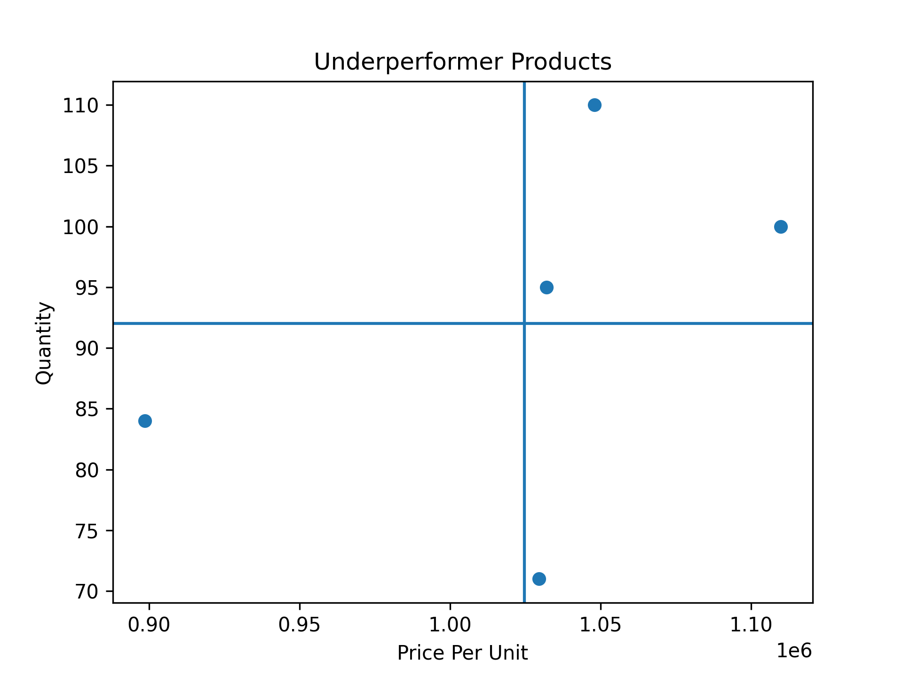
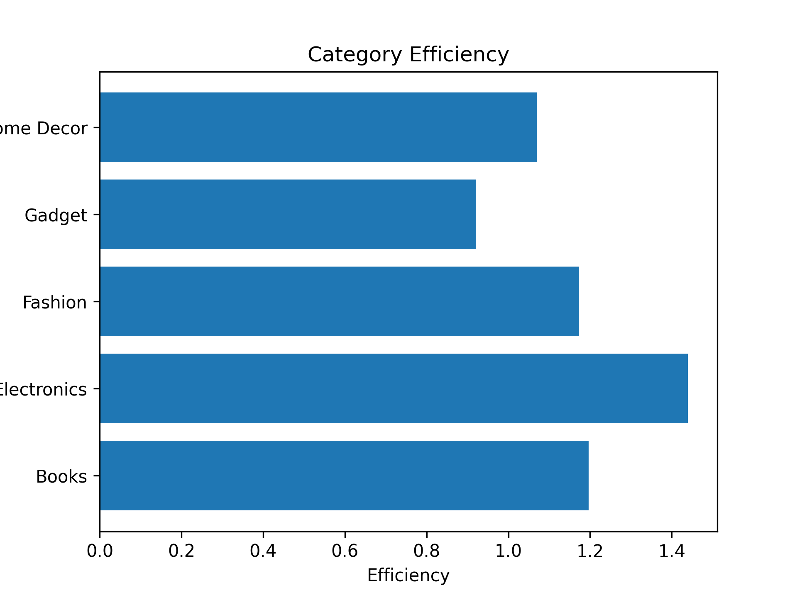

# KKAPRAKDATA

# 📊 Laporan Praktikum Analisis Performa Penjualan

---

## 1. Business Question

Beberapa pertanyaan yang ingin dijawab dalam analisis ini adalah:

- Produk apa yang termasuk **underperformer** (harga tinggi tetapi penjualan rendah)?
- Siapa pelanggan terbaik berdasarkan **RFM Analysis**?
- Kategori produk mana yang paling efisien dalam penggunaan anggaran iklan?
- Apakah anggaran iklan berpengaruh terhadap penjualan?

---

## 2. Data Wrangling

Proses pembersihan dan persiapan data yang dilakukan:

- Menghapus data dengan nilai **Price_Per_Unit ≤ 0**
- Mengubah kolom **Order_Date** menjadi format datetime
- Mengelompokkan data berdasarkan:
  - Product_Category
  - CustomerID
- Menghitung:
  - Rata-rata harga produk
  - Total quantity penjualan
  - Total penjualan (Total_Sales)
  - Total anggaran iklan (Ad_Budget)

---

## 3. Insights

### 📊 Underperformer Product

Produk dengan harga tinggi tetapi memiliki jumlah penjualan rendah.

**Insight:**
- Terdapat beberapa kategori produk dengan harga di atas rata-rata tetapi quantity rendah
- Hal ini menunjukkan bahwa harga tinggi dapat menjadi faktor penghambat penjualan

---

### 📦 Efisiensi Kategori

Perbandingan antara total penjualan dan anggaran iklan.

**Insight:**
- Tidak semua kategori dengan anggaran iklan besar menghasilkan penjualan tinggi
- Beberapa kategori memiliki efisiensi rendah
- Ada kategori yang lebih efektif dalam menghasilkan penjualan

---

### 👥 RFM Analysis

**Insight:**
- Pelanggan dengan nilai RFM tinggi merupakan pelanggan loyal
- Mereka sering melakukan transaksi dan memberikan kontribusi besar terhadap pendapatan

---

### 📢 Uji Hipotesis

**Insight:**
- Rata-rata penjualan pada kelompok iklan tinggi lebih besar dibandingkan dengan iklan rendah
- Hal ini menunjukkan bahwa iklan berpengaruh terhadap penjualan

---

## 4. Recommendation

Berdasarkan hasil analisis, berikut rekomendasi:

- Menurunkan harga atau memberikan promo pada produk underperformer
- Fokus pada pelanggan loyal dengan program khusus
- Mengurangi anggaran iklan pada kategori yang tidak efisien
- Meningkatkan anggaran iklan pada kategori yang efektif
- Melakukan evaluasi strategi pemasaran secara berkala

---

## 5. Kesimpulan

- Harga produk, strategi iklan, dan perilaku pelanggan sangat mempengaruhi performa penjualan
- Produk mahal tidak selalu menghasilkan penjualan tinggi
- Strategi yang tepat dapat meningkatkan efisiensi dan keuntungan perusahaan

---

## 🚀 Cara Menjalankan

1. Install library:
